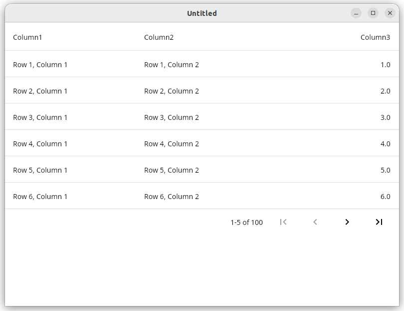

# Compose Data Table

This library is an implementation of the [Material Design data table](https://m2.material.io/components/data-tables) for Compose.

The original code is derived from the implementation that was removed from Compose pre-1.0. The goal is to implement the entire Material Design spec for data tables.



## Getting started

Add the dependency to your gradle build file:

Non-material version:

```kotlin
implementation("com.seanproctor:datatable:<VERSION>")
```

Material 3:

```kotlin
implementation("com.seanproctor:datatable-material3:<VERSION>")
```

Draw a table

```kotlin
var selectedRow by remember { mutableStateOf<Int?>(null) }
DataTable(
    columns = listOf(
        DataColumn {
            Text("Header A")
        },
        DataColumn {
            Text("Header B")
        },
        DataColumn(Alignment.CenterEnd) {
            Text("Header C")
        },
    )
) {
    row {
        onClick = { selectedRow = 0 }
        cell { Text("Cell A1") }
        cell { Text("Cell B1") }
        cell { Text("Cell C1") }
    }
    row {
        onClick = { selectedRow = 1 }
        cell { Text("Cell A2") }
        cell { Text("Cell B2") }
        cell { Text("Cell C2") }
    }
}
```

Draw a paginated table
```kotlin
PaginatedDataTable(
    columns = listOf(
        DataColumn {
            Text("Column1")
        },
        DataColumn {
            Text("Column2")
        },
        DataColumn {
            Text("Column3")
        },
    ),
    state = rememberPaginatedDataTableState(5),
) {
    for (rowIndex in 0 until 100) {
        row {
            onClick = { println("Row clicked: $rowIndex") }
            cell {
                Text("Row $rowIndex, column 1")
            }
            cell {
                Text("Row $rowIndex, column 2")
            }
            cell {
                Text("Row $rowIndex, column 3")
            }
        }
    }
}
```
